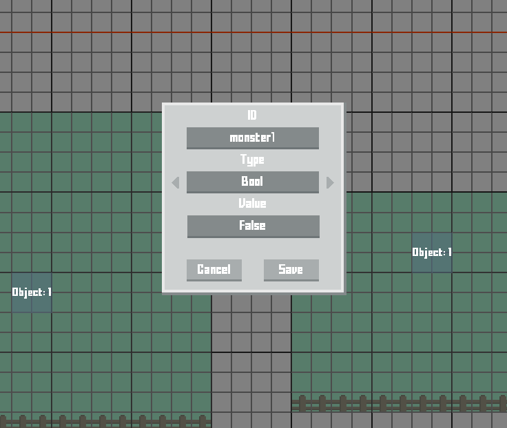

A C# tile map world / game creator. 
Features:
Create seperate areas without limit to the size.
Add a spritesheet and use different tools to draw / fill the areas.
Add seperate layers for your sprites.
Add custom objects, allowing placement of NPC's, monsters, items, etc.
Add collision to your sprites.
Test your world from within the engine.

